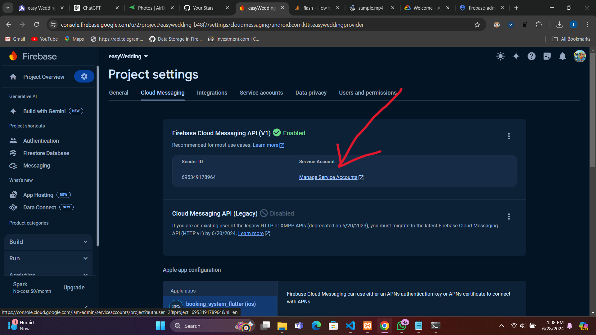
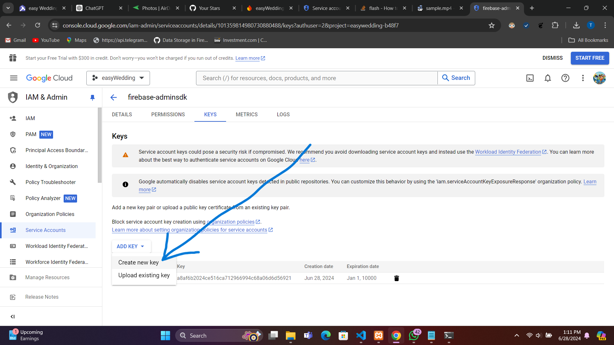
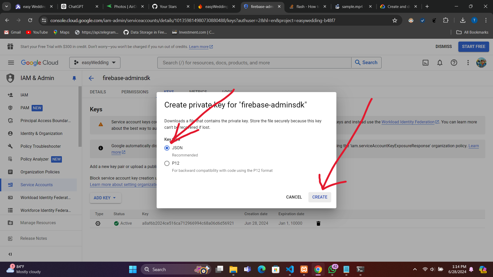

# Firebase Cloud Messaging via REST API using PHP

This repository contains a PHP script to send Firebase Cloud Messages (FCM) via the REST API. It includes both the generation of an OAuth2 access token using a Google service account key and the sending of FCM messages.

## Instructions

1. **Clone the Repository**

   ```sh
   git clone https://github.com/tharushaudana/fcm-send-with-oauth2-php.git
   ```

2. **Edit Service Account Key Path**

   In `access_token.php`, replace the placeholder with the path to your Google service account key JSON file:

   ```php
   $creds = file_get_contents('path/to/your/service-account-key.json');
   ```

3. **Edit FCM Data**

   In `index.php`, edit the FCM data to suit your needs. Change the `validate_only` parameter to `true` if you only want to validate the request without sending a message:

   ```php
   $firebase_data = [
       'validate_only' => false,
       'message' => [
           'topic' => 'user_4',
           'notification' => [
               'title' => 'test title',
               'body' => 'test body',
           ],
           'android' => [
               'collapse_key' => 'type_a',
           ],
           'data' => [
               'test' => 'test value'
           ]
       ]
   ];
   ```

4. **Load `index.php` Using a Web Server**

   Ensure you are running a web server, then load `index.php` to send the FCM message.

## Generating and Downloading the Google Service Account Key

The screenshots below will help you create and download the Google service account key JSON for your Firebase project:

- 
- 
- 

I hope this helps you implement the latest FCM send method via the REST API.
